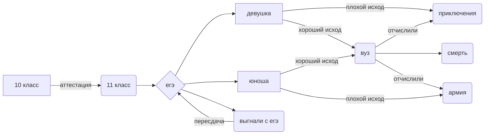

http://morzedlyachainikov.tilda.ws/

<!-- clock widget start -->
 

<a href="https://nochi.com/time/tomsk-17430">Томск</a> 

 
<!-- clock widget end -->

# alexgnett.github.io
Голубцова Александра 

$$ Ag_{2}O + 4NH_{3}\cdot H_{2}O \Rightarrow 2Ag \left[ (NH_3)_2 OH \right] + 3H_2O $$

$$ sinx ' = cosx $$

$$ m_{H_{2}O} =V\cdot \rho_{H_{2}O} $$

<a href="https://www.youtube.com/watch?v=dQw4w9WgXcQ&ysclid=lbbtf0a4yd370287279" class="button_1670306547930" target="_blank">
  Слив вариантов ЕГЭ химия 2023
</a>

<a href="https://github.com/alexgnett" class="button_1670306547930" target="_blank">
  мой гитхаб
</a>

<iframe allowfullscreen frameborder="0" style="width:640px; height:480px" src="https://lucid.app/documents/embedded/89c3a8d2-ad0b-441f-ade1-c43ee9efbf6f" id=".yJ92SmM-YD3"></iframe>

<iframe title="ANIME COMIC" frameborder="0" width="1200" height="675" style="position: absolute; top: 0; left: 0; width: 100%; height: 100%;" src="https://view.genial.ly/63733947fe026a00197b8556" type="text/html" allowscriptaccess="always" allowfullscreen="true" scrolling="yes" allownetworking="all"></iframe> 
 

